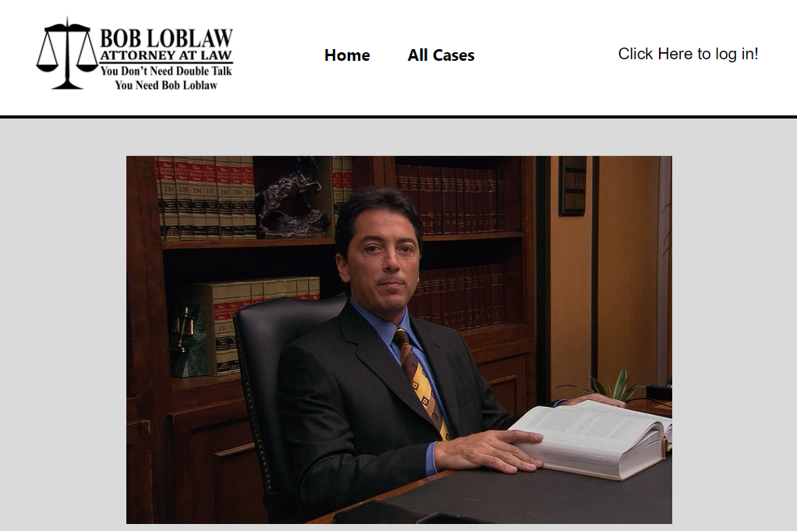

  

# Bob Loblaw's Law Blog

Lawyer Bob Loblaw from the offices of Bob Loblaw's blog where all cases he's completed is posted. A comprehensive list of all of Bob Loblaw's case history.

## Project Exam Front End Year 1
* Brief:

You have been hired to build a front-end user interface for an existing API blogging
application. The client has asked for a responsive application that allows users to view
dynamic blog posts. The client requires admin pages to register, login and manage their
blog posts. During testing, you will use your own account that you create to act as the
owner

## Screenshot:

  

## Client:

* Name: Offices of Bob Loblaw
* Sector: Law and Order
* Size: 3 employees
* Location: Newport Beach, California
* Mission: Provide the latest cases of Bob Loblaw.
## Authors

- [@JNettli](https://www.github.com/jnettli)

## License

[MIT](https://choosealicense.com/licenses/mit/)
## Figma Link:
[Figma](https://www.figma.com/design/68iFzzbNBIJfnUlCM7nDCN/Bob-Loblaw-Law-Blog?node-id=0-1&t=QQKumheDp6W48tek-0)
